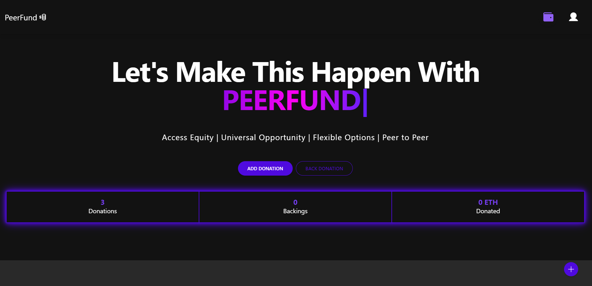
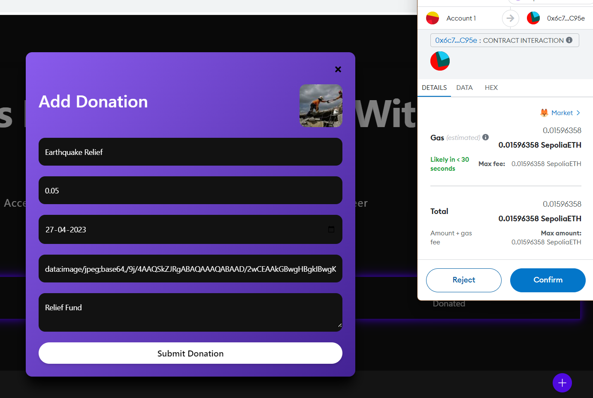
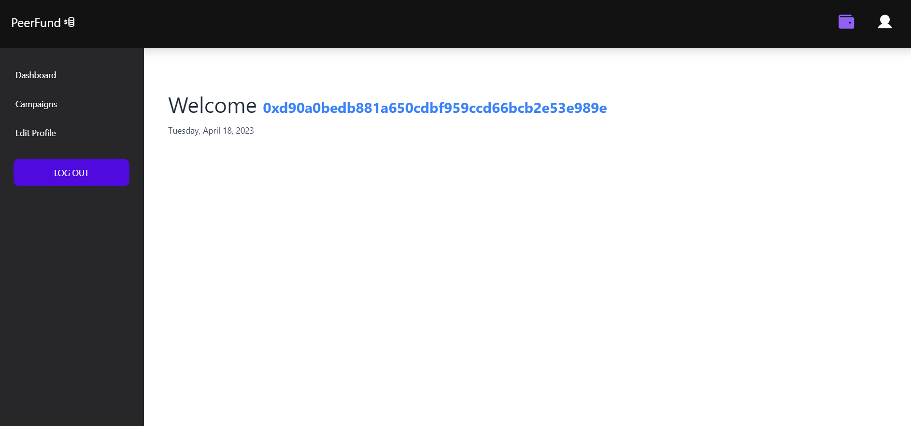
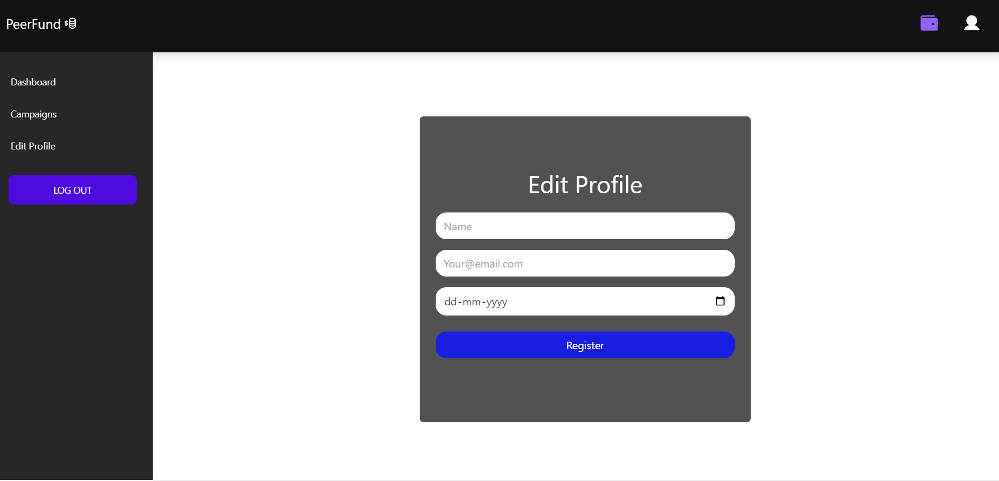
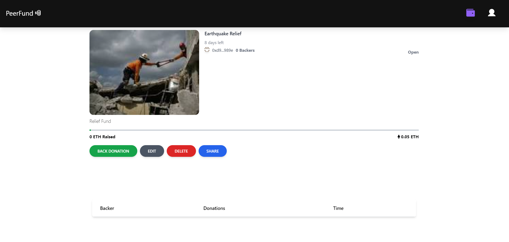
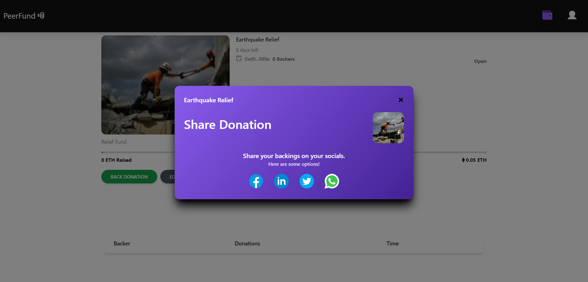

# PEERFUND

A crowdfunding platform based on blockchain

---

## Problem Statement

People always have been insecure about the risks crowdfunding platforms come with. The most common problems they face are most of the campaigns around the world are not regulated and some of the crowd funding campaigns turned out to be fraud. There are Several challenges faced by individuals and organizations seeking to raise funds through crowdfunding platforms.Some of them including Lack of Transparency, Limited access, High Fees, Risk Of Fraud and Lack Of Flexibility.

## Our Approach/Solution

We are using Blockchain technology for crowdfunding because it offers several benefits which traditional crowdfunding methods do not provide.blockchain technology allows for the creation of decentralized crowdfunding platforms that can operate without intermediaries such as banks or other financial institutions. This means that funds can be raised and distributed directly between individuals, without the need for a third party to manage the process.Secondly, Blockchain technology provides a high degree of transparency and accountability. Transactions on a blockchain are recorded and cannot be altered, ensuring that all contributions to a crowdfunding campaign are visible to everyone on the network. This creates a sense of trust among participants involved.
We are making use of smart contracts, which are self-executing contracts with the terms of the agreement between buyer and seller being directly written into lines of code. Smart contracts can be used to automate the process, ensuring that funds are only released when certain conditions are met.

## Future Scope

Blockchain crowdfunding platforms have already shown great potential in disrupting the traditional methods of fundraising.
some potential areas of growth and development for our blockchain crowdfunding app are:

1. We can make this project even more secure by using more advanced and sophisticated decentralized security techniques making the enviorment more transparent and more versatile.
2. As our platform continue to incorporate smart contracts, it can automate many of the processes involved in fundraising, reducing the need for intermediaries and increasing efficiency.
3. Our project can be extended to enable cross-border fundraising, allowing startups and organizations to tap into a global pool of investors and supporters, and also for charity works throughout the world in matters of human development.

## Demo
<h1 align="center">
  
  
  
  
  
  
  
  
  
</h1>
---

## Getting Started

### Prerequisites

- MongoDB
- Express
- React
- Node
- Solidity

### Installation

#### Contracts

1. `cd` into the web3 directory
2. Run `yarn` to install all the dependencies
3. Configure the environment variables
   - RPC URL for your testnet
   - Your wallet's private key
   - API key from Etherscan
   - API key fromm Coinmarketcap
4. For testing purposes, the contract can be deployed to a local hardhat node by running `yarn hardhat node`
5. To deploy the contract to a testnet, run `yarn hardhat deploy --network {network}` replacing {network} with the desired network

#### Client

1. `cd` into the client directory
2. Run `npm install --legacy-peer-deps`
3. Run `npm start` to start the client

#### Server

1. `cd` into the server directory
2. Run `npm install`
3. Run `node index.js` to start the server
